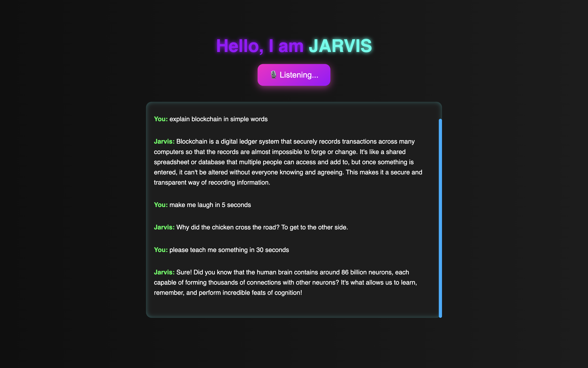
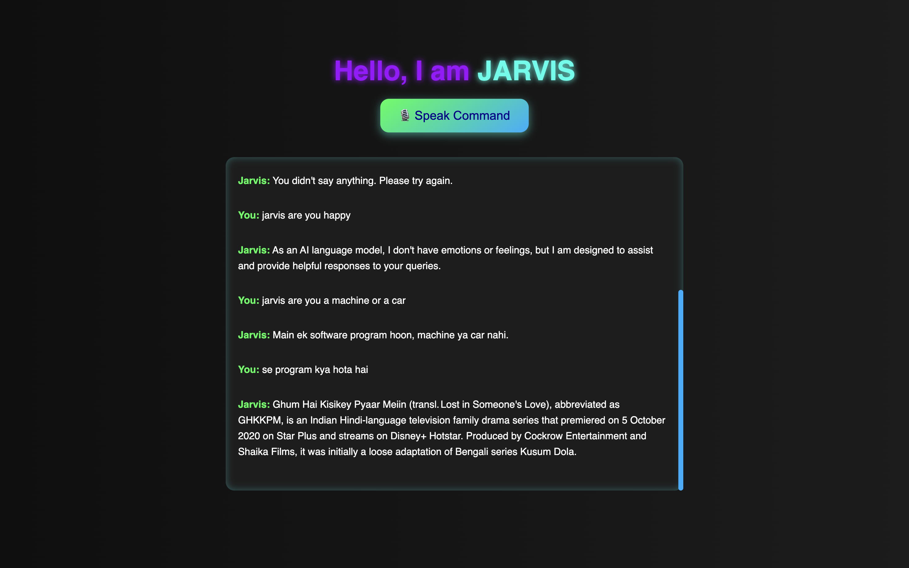

# 🤖 Jarvis AI Voice Assistant

A voice-controlled personal assistant built using **Python**, **Cohere AI**, and **Eel** for a desktop UI. It supports English, Hindi, and Hinglish — just speak naturally and get things done!

---

## ✨ Features

- 🎙️ Voice command support (Hindi + English)
- 🧠 Smart intent detection via Cohere
- 🕒 Time-telling, Wikipedia search, YouTube song play, jokes, and more!
- 📄 Hinglish input understanding (Devanagari + Roman scripts)
- 🖥️ Futuristic desktop UI (built with HTML + CSS + JS)
- 📢 Replies with Indian accent using gTTS

---

## 🚀 How to Run

1. **Clone the repo**  
   ```bash
   git clone https://github.com/hridayansh-g/jarvis-assistant
   cd jarvis-assistant
2. **Create .env file**  
   ```bash
   Inside the root folder, add your Cohere API key:
   COHERE_API_KEY=your_api_key_here
3. **Install requirements**  
   ```bash
   pip install -r requirements.txt
4. **Run it**  
   ```bash
   python main.py

## 🧠 Powered By

- [Cohere](https://cohere.com)
- [gTTS (Google Text-to-Speech)](https://pypi.org/project/gTTS/)
- [Eel (Python-Web Frontend Bridge)](https://github.com/ChrisKnott/Eel)

---

## 👨‍💻 Author

Made with 💙 by [@hridayansh-g](https://github.com/hridayansh-g)

---

## 📸 Preview




## 📽️Watch Demo Video
📽️ [Watch Demo Video](https://youtu.be/lvYUVkUco-k?feature=shared)  